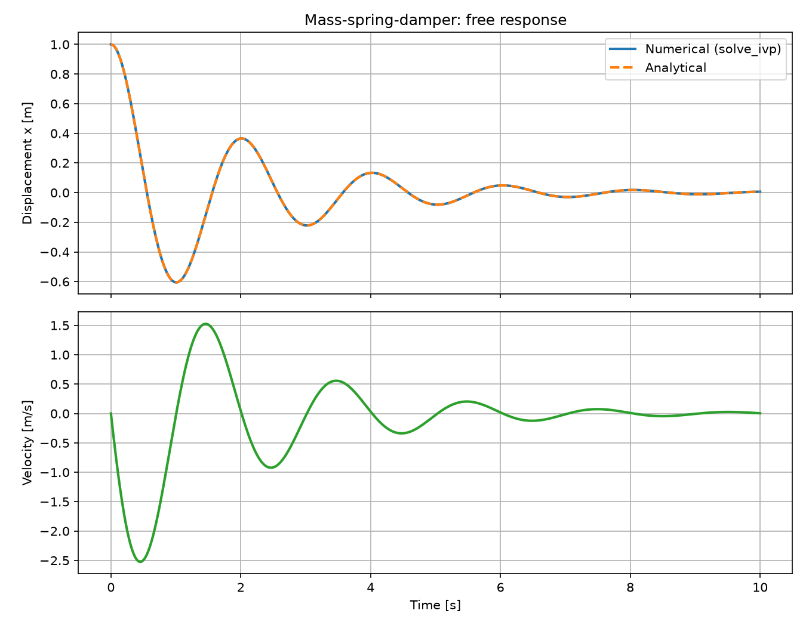
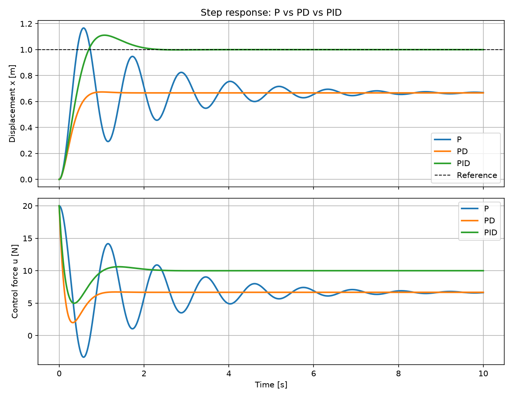

# mass-spring-damper-control

Dynamic simulation and control of a mass-spring-damper system using Python and MATLAB/Simulink. :)

## Overview

This project models a one-degree-of-freedom mass-spring-damper system, simulates its dynamic response, and designs and compares different feedback controllers.

**Project status**

- [x] Mathematical model
- [x] Free-response simulation in Python (validated against the analytical solution)
- [x] P controller
- [x] PD controller
- [x] PID controller
- [ ] LQR controller
- [ ] MATLAB/Simulink implementation

## Objectives

- Derive the equation of motion and its state-space representation.
- Simulate the system numerically and validate the results against the analytical solution.
- Design and compare P, PD, PID and LQR controllers.
- Reproduce the simulations in MATLAB/Simulink and compare them with the Python results.

## Project Structure

```
mass-spring-damper-control/
├── docs/
│   └── mathematical_model.md   # Model derivation
├── src/
│   ├── simulation.py           # Free response + analytical validation
│   └── control_pid.py          # P, PD and PID closed-loop simulation
├── results/                    # Generated plots
├── requirements.txt
└── README.md
```

## Mathematical Model

The system is described by:

$$
m\ddot{x} + c\dot{x} + kx = F(t)
$$

In state-space form, with $\mathbf{x} = [x,\ \dot{x}]^T$ and input $u = F(t)$:

$$
\dot{\mathbf{x}} = A\mathbf{x} + B u,
\qquad
A = \begin{bmatrix} 0 & 1 \\ -\frac{k}{m} & -\frac{c}{m} \end{bmatrix},
\quad
B = \begin{bmatrix} 0 \\ \frac{1}{m} \end{bmatrix}
$$

Parameters used in the simulations:

| Parameter | Symbol | Value | Unit |
|---|---:|---:|---|
| Mass | $m$ | 1 | kg |
| Spring stiffness | $k$ | 10 | N/m |
| Damping coefficient | $c$ | 1 | Ns/m |

With these values, $\omega_n \approx 3.16$ rad/s and $\zeta \approx 0.158$, so the open-loop system is underdamped.

The full derivation is available in [`docs/mathematical_model.md`](docs/mathematical_model.md).

## Simulation

The free response (initial displacement $x(0) = 1$ m, no external force) is solved with `scipy.integrate.solve_ivp` and compared with the analytical solution. The maximum difference between both is around $10^{-10}$ m.

```bash
python src/simulation.py
```



## Control

All controllers are tested on the same plant with a unit step reference $r = 1$ m, starting from rest. The position error is $e = r - x$ and the controller output $u$ is the force applied to the mass.

```bash
python src/control_pid.py
```

### P Controller

Proportional feedback on the position error:

$$
u = K_p\,e
$$

The proportional action alone does not add damping, so the response is very oscillatory. It also leaves a steady-state error:

$$
e_{ss} = \frac{r\,k}{k + K_p}
$$

With $K_p = 20$ N/m, $e_{ss} = 0.333$ m, which matches the simulation.

### PD Controller

Proportional feedback plus derivative action on the measured velocity:

$$
u = K_p\,e - K_d\,\dot{x}
$$

The derivative term adds damping ($c + K_d$ in the closed loop), which removes the oscillations. It does not remove the steady-state error.

### PID Controller

Adds an integral term that accumulates the error:

$$
u = K_p\,e + K_i \int_0^t e\,d\tau - K_d\,\dot{x}
$$

The integral action drives the steady-state error to zero.

**Gains used**

| Controller | $K_p$ [N/m] | $K_i$ [N/(m·s)] | $K_d$ [Ns/m] |
|---|---:|---:|---:|
| P | 20 | 0 | 0 |
| PD | 20 | 0 | 8 |
| PID | 20 | 40 | 8 |

### LQR Controller

Optimal state feedback that minimizes the cost function

$$
J = \int_0^\infty \left( \mathbf{x}^T Q \mathbf{x} + u^T R u \right) dt,
\qquad
u = -K\mathbf{x}
$$

where $K$ is obtained by solving the algebraic Riccati equation.

*Status: planned.*

## Results



| Controller | Overshoot | Settling time (2 %) | Steady-state error |
|---|---:|---:|---:|
| P | 16.7 % | never | 0.33 m |
| PD | 0 % | never | 0.33 m |
| PID | 11.1 % | 1.91 s | 0 m |

"Never" means the response does not enter the 2 % band around the reference, because it settles at a different value.

**Conclusions**

- **P:** fast but poorly damped, and with a permanent error.
- **PD:** the derivative action removes the oscillations, but the error remains.
- **PID:** the only one that reaches the reference exactly, at the cost of some overshoot.

LQR comparison: *coming soon.*

## MATLAB/Simulink

*Coming soon.* A Simulink model of the same system will be added in a `simulink/` folder, and its results will be compared with the Python simulation.

## Installation

Clone the repository:

```bash
git clone https://github.com/pablorope3/mass-spring-damper-control.git
cd mass-spring-damper-control
```

**Option A: conda**

```bash
conda create -n msd python=3.11
conda activate msd
pip install -r requirements.txt
```

**Option B: venv**

```bash
python -m venv .venv
source .venv/bin/activate      # Mac/Linux
.venv\Scripts\activate         # Windows
pip install -r requirements.txt
```

Run the simulations:

```bash
python src/simulation.py      # free response
python src/control_pid.py     # P, PD and PID controllers
```

The plots are saved in the `results/` folder.
