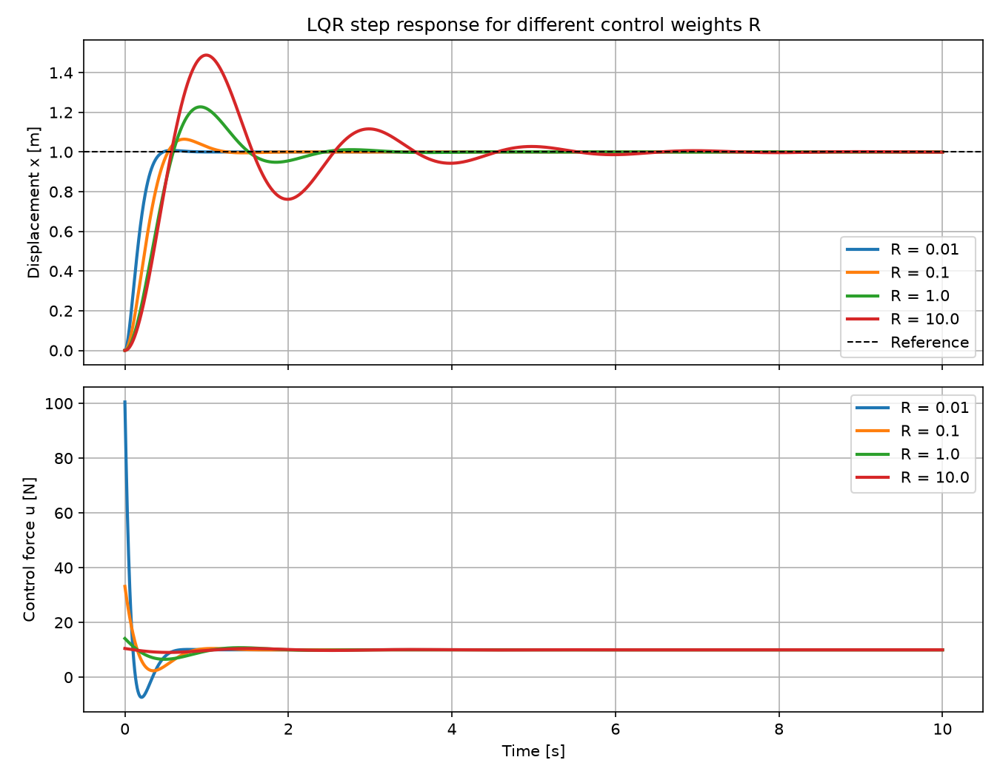
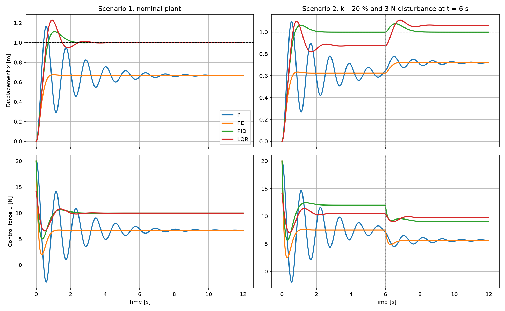

# mass-spring-damper-control

Dynamic simulation and control of a mass-spring-damper system using Python and MATLAB/Simulink. :)

## Overview

This project models a one-degree-of-freedom mass-spring-damper system, simulates its dynamic response, and designs and compares four feedback controllers (P, PD, PID and LQR), including a test with model error and an external disturbance.

**Project status**

- [x] Mathematical model
- [x] Free-response simulation in Python (validated against the analytical solution)
- [x] P controller
- [x] PD controller
- [x] PID controller
- [x] LQR controller
- [x] Final comparison of the four controllers (nominal and perturbed plant)
- [ ] MATLAB/Simulink implementation

## Table of Contents

- [Objectives](#objectives)
- [Project Structure](#project-structure)
- [Control Theory Basics](#control-theory-basics)
- [Mathematical Model](#mathematical-model)
- [Simulation](#simulation)
- [Control](#control)
- [Results](#results)
- [Possible Improvements](#possible-improvements)
- [MATLAB/Simulink](#matlabsimulink)
- [Installation](#installation)

## Objectives

- Derive the equation of motion and its state-space representation.
- Simulate the system numerically and validate the results against the analytical solution.
- Design P, PD, PID and LQR controllers and understand what each one does and why.
- Compare them on the nominal plant and on a plant with model error and a disturbance.
- Reproduce the simulations in MATLAB/Simulink and compare them with the Python results.

## Project Structure

```
mass-spring-damper-control/
├── docs/
│   └── mathematical_model.md   # Model derivation
├── src/
│   ├── simulation.py           # Free response + analytical validation
│   ├── control_pid.py          # P, PD and PID closed-loop simulation
│   ├── control_lqr.py          # LQR design and effect of the weight R
│   └── compare_controllers.py  # Final comparison of the four controllers
├── results/                    # Generated plots
├── requirements.txt
└── README.md
```

## Control Theory Basics

This section introduces the vocabulary used in the rest of the project.

### What is a plant?

In control engineering, the **plant** is the system we want to control: the physical process whose behavior we want to influence. It could be a motor, a drone, a chemical reactor, a car suspension... In this project, the plant is a mass attached to a spring and a damper.

A plant has:

- **Input** $u$: what we can act on. Here, the force applied to the mass.
- **Output** $y$: what we measure and want to control. Here, the position $x$ of the mass.
- **Disturbances** $d$: external effects we cannot choose, such as an unexpected push on the mass.

Left alone, the plant does not necessarily do what we want. This mass-spring-damper, for instance, oscillates for a while after being pushed and always returns to its rest position, so we cannot make it hold an arbitrary position. A **controller** is an algorithm that decides the input $u$ so that the output behaves as desired.

### Open loop vs closed loop

- **Open loop**: the controller computes $u$ without looking at the output. It works only if the model is perfect and there are no disturbances.
- **Closed loop (feedback)**: the controller measures the output, compares it with the desired value, and corrects. This is what makes a system robust to errors and disturbances.

```
                                    d (disturbance)
                                    |
                                    v
         e      +------------+  u  +-------+
 r ---->(+)---->| Controller |---->| Plant |----+----> y (position x)
         ^ -    +------------+     +-------+    |
         |                                      |
         +--------------------------------------+
                   feedback (sensor)
```

- $r$: **reference** (setpoint), the value we want the output to reach.
- $y$: measured output (here, $y = x$).
- $e = r - y$: **error**, the difference between what we want and what we have.

### Describing a plant mathematically

A plant is described by a model. Three equivalent ways are used in this project:

1. **Differential equation** (from physical laws): $m\ddot{x} + c\dot{x} + kx = F$.
2. **State-space**: $\dot{\mathbf{x}} = A\mathbf{x} + Bu$. The *state* $\mathbf{x}$ collects the variables that completely describe the system at each instant (here, position and velocity). It is the natural form for simulation and for LQR.
3. **Transfer function**: the relation between input and output in the Laplace domain, $G(s) = X(s)/F(s) = 1/(ms^2 + cs + k)$.

### Poles and stability

The **poles** of a system are the roots of the denominator of its transfer function (equivalently, the eigenvalues of $A$). They determine its natural behavior:

- If all poles have **negative real part**, the system is **stable**: it returns to equilibrium after a disturbance.
- A pair of complex poles $-\sigma \pm j\omega_d$ gives an **oscillation** at frequency $\omega_d$ that decays as $e^{-\sigma t}$. The further left the poles, the faster the response.
- A **damping ratio** $\zeta$ measures how oscillatory the response is: $\zeta = 0$ oscillates forever, $0 < \zeta < 1$ oscillates and decays (underdamped), $\zeta \geq 1$ does not oscillate.

**Feedback changes the poles.** This is the main idea behind controller design: choosing the controller moves the poles of the closed-loop system to better locations.

### Performance specifications

To judge a controller, the step response (the output when the reference jumps from 0 to a constant value) is usually analyzed:

| Metric | Meaning |
|---|---|
| **Overshoot** | How much the output exceeds the reference at its peak, in %. |
| **Settling time** | Time after which the output stays within a band (here 2 %) around the reference. |
| **Steady-state error** | Difference between the reference and the final value of the output. |
| **Control effort** | How much force the controller needs (peak and total). It is limited in real actuators. |
| **Robustness** | Whether the controller still works when the real plant differs from the model, or when disturbances appear. |

These goals conflict with each other: making the response faster usually increases the control effort and the overshoot. Control design is about choosing a good compromise.

## Mathematical Model

The system is described by:

$$
m\ddot{x} + c\dot{x} + kx = F(t)
$$

In state-space form, with $\mathbf{x} = [x,\ \dot{x}]^T$ and input $u = F(t)$:

$$
\dot{\mathbf{x}} = A\mathbf{x} + B u,
\qquad
A = \begin{bmatrix} 0 & 1 \\ -\frac{k}{m} & -\frac{c}{m} \end{bmatrix},
\quad
B = \begin{bmatrix} 0 \\ \frac{1}{m} \end{bmatrix}
$$

Parameters used in the simulations:

| Parameter | Symbol | Value | Unit |
|---|---:|---:|---|
| Mass | $m$ | 1 | kg |
| Spring stiffness | $k$ | 10 | N/m |
| Damping coefficient | $c$ | 1 | Ns/m |

With these values, $\omega_n \approx 3.16$ rad/s and $\zeta \approx 0.158$, so the open-loop system is underdamped (open-loop poles: $-0.5 \pm 3.12j$).

The full derivation is available in [`docs/mathematical_model.md`](docs/mathematical_model.md).

## Simulation

The free response (initial displacement $x(0) = 1$ m, no external force) is solved with `scipy.integrate.solve_ivp` and compared with the analytical solution. The maximum difference between both is around $10^{-10}$ m.

```bash
python src/simulation.py
```


## Control

All controllers are tested on the same plant with a unit step reference $r = 1$ m, starting from rest. The position error is $e = r - x$ and the controller output $u$ is the force applied to the mass.

```bash
python src/control_pid.py   # P, PD and PID
python src/control_lqr.py   # LQR
```

### P Controller

**Idea.** The force is proportional to the error: the further the mass is from the reference, the harder we push. It acts like an extra virtual spring.

$$
u = K_p\,e
$$

**Effect on the plant.** Substituting in the equation of motion:

$$
m\ddot{x} + c\dot{x} + (k + K_p)\,x = K_p\,r
$$

The controller only adds stiffness ($k \to k + K_p$). The response gets faster, but the damping $c$ does not change, so the system becomes more oscillatory: with $K_p = 20$, $\zeta$ drops from 0.158 to 0.091.

**Steady-state error.** At rest ($\dot{x} = \ddot{x} = 0$) the equation gives $x = \frac{K_p}{k + K_p}\,r$, so:

$$
e_{ss} = \frac{k}{k + K_p}\,r = 0.333\ \text{m}
$$

Increasing $K_p$ reduces this error but never removes it, and makes the oscillations worse.

**Pros / cons.** Simplest controller, one gain. Cannot remove the steady-state error and does not damp the oscillations.

### PD Controller

**Idea.** Adds a term proportional to the velocity that opposes the motion. It acts like an extra virtual damper.

$$
u = K_p\,e - K_d\,\dot{x}
$$

The derivative acts on the measured velocity instead of $\dot{e}$. For a constant reference both are equivalent, but this avoids a force spike when the reference jumps.

**Effect on the plant.**

$$
m\ddot{x} + (c + K_d)\,\dot{x} + (k + K_p)\,x = K_p\,r
$$

The damping increases from $c$ to $c + K_d$. With $K_d = 8$, $\zeta \approx 0.82$ and the oscillations disappear.

**Steady-state error.** At rest $\dot{x} = 0$, so the derivative term vanishes and the error is the same as with the P controller (0.333 m). The derivative action shapes the transient, not the final value.

**Pros / cons.** Fixes the oscillations and gives a smooth response. Does not remove the steady-state error. In real systems, the derivative amplifies sensor noise (not modeled here).

### PID Controller

**Idea.** Adds an integral term that accumulates the error over time. While any error remains, the integral keeps growing and pushes the force until the error is gone.

$$
u = K_p\,e + K_i \int_0^t e\,d\tau - K_d\,\dot{x}
$$

**Why it removes the steady-state error.** In a steady state, all signals are constant. The integral can only be constant if $e = 0$. Therefore, if the system settles, it settles exactly at the reference, without needing to know $k$ or any disturbance.

**Effect on the plant.** The closed loop becomes third order, with characteristic polynomial

$$
m s^3 + (c + K_d)\,s^2 + (k + K_p)\,s + K_i = 0
$$

With the gains used, the poles are $-4$ and $-2.5 \pm 1.94j$, all stable. The integral action also introduces some overshoot, because the integral term keeps pushing for a while after the mass crosses the reference.

**Gains used**

| Controller | $K_p$ [N/m] | $K_i$ [N/(m·s)] | $K_d$ [Ns/m] |
|---|---:|---:|---:|
| P | 20 | 0 | 0 |
| PD | 20 | 0 | 8 |
| PID | 20 | 40 | 8 |

**Pros / cons.** Zero steady-state error and good rejection of constant disturbances and model errors. Three gains to tune; a too large $K_i$ makes the response oscillatory or unstable. With real actuator limits, the integral can "wind up" (see [Possible Improvements](#possible-improvements)).


| Controller | Overshoot | Settling time (2 %) | Steady-state error |
|---|---:|---:|---:|
| P | 16.7 % | never | 0.33 m |
| PD | 0 % | never | 0.33 m |
| PID | 11.1 % | 1.91 s | 0 m |

"Never" means the response does not enter the 2 % band around the reference, because it settles at a different value.

### LQR Controller

**Idea.** The previous controllers are tuned by trial and error. The LQR (Linear Quadratic Regulator) instead *computes* the best state-feedback gain for a given criterion. It uses the model ($A$, $B$) and two weight matrices that express what we care about: keeping the state small (matrix $Q$) and not spending too much force (matrix $R$). It minimizes the cost

$$
J = \int_0^\infty \left( \mathbf{x}^T Q \mathbf{x} + u^T R u \right) dt
$$

The solution is a **state feedback** that uses both position and velocity: $K = R^{-1}B^TP$, where $P$ solves the algebraic Riccati equation. This is computed with `scipy.linalg.solve_continuous_are`.

**Tracking a reference.** The LQR is a *regulator*: it drives the state to zero. To track a reference $r \neq 0$, a feedforward term is added:

$$
u = -K\mathbf{x} + N r,
\qquad
N = k + K_1
$$

$N$ compensates the spring force at the final position, giving zero steady-state error. **This relies on an exact model**: if the real stiffness differs from the modeled one, an error remains. The PID does not have this problem thanks to its integral action.

**Design.** With $Q = \mathrm{diag}(100,\ 1)$ (penalty on position and velocity) and $R = 1$, the gain is $K = [4.14,\ 2.21]$. The closed-loop poles move from $-0.5 \pm 3.12j$ to $-1.60 \pm 3.40j$ ($\zeta \approx 0.43$).

**Effect of the weight $R$**

| $R$ | $K_1$ | $K_2$ | Overshoot | Settling time (2 %) | Max. force |
|---:|---:|---:|---:|---:|---:|
| 0.01 | 90.50 | 15.79 | 0.8 % | 0.41 s | 100.5 N |
| 0.1 | 23.17 | 6.57 | 6.5 % | 1.05 s | 33.2 N |
| 1 | 4.14 | 2.21 | 22.7 % | 2.24 s | 14.1 N |
| 10 | 0.49 | 0.44 | 48.8 % | 5.23 s | 10.5 N |

A small $R$ ("force is cheap") gives a fast and well-damped response but demands a large force; a large $R$ ("force is expensive") saves control effort at the cost of a slower, more oscillatory response. This is the speed/effort trade-off made explicit.

**Pros / cons.** Systematic design, uses all the states, and handles multi-variable systems naturally. It needs a good model and full state measurement, and as implemented here it has no integral action.



## Results

The four controllers are compared with `src/compare_controllers.py`:

```bash
python src/compare_controllers.py
```

Two scenarios are simulated with the same controllers, designed on the nominal model:

1. **Nominal plant**: the real plant is exactly the model.
2. **Perturbed plant**: the real stiffness is 20 % higher than the model, and a constant disturbance force of 3 N appears at $t = 6$ s.



### Scenario 1: nominal plant

| Controller | Overshoot | Settling time (2 %) | Steady-state error | ISE |
|---|---:|---:|---:|---:|
| P | 16.7 % | never | 0.33 m | 1.578 |
| PD | 0 % | never | 0.33 m | 1.558 |
| PID | 11.1 % | 1.91 s | 0 | 0.247 |
| LQR | 22.7 % | 2.23 s | 0 | 0.269 |

ISE is the integral of the squared error: the lower, the better the tracking over the whole response. The LQR settling time differs by 0.01 s from the table in the LQR section because of the different time resolution of the two scripts.

### Scenario 2: model error and disturbance

| Controller | Error before the disturbance | Error at the end |
|---|---:|---:|
| P | 0.354 m | 0.278 m |
| PD | 0.375 m | 0.281 m |
| PID | 0 | 0 |
| LQR | 0.124 m | -0.062 m |

### Qualitative summary

| | P | PD | PID | LQR (as implemented) |
|---|:---:|:---:|:---:|:---:|
| Removes steady-state error (nominal) | no | no | yes | yes |
| Adds damping | no | yes | yes | yes |
| Robust to model error | no | no | yes | no |
| Rejects constant disturbances | no | no | yes | no |
| Uses velocity measurement | no | yes | yes | yes |
| Tuning | 1 gain | 2 gains | 3 gains | weights $Q$, $R$ |

### Conclusions

- **P:** fast but poorly damped, and with a permanent error. Useful to understand feedback, rarely enough on its own.
- **PD:** the derivative action removes the oscillations, but the steady-state error remains.
- **PID:** the only one that reaches the reference in both scenarios, thanks to the integral action. It does not need an accurate model.
- **LQR:** an excellent transient with a systematic design and a clear speed/effort trade-off, but the feedforward term makes it sensitive to model error. In scenario 2 its error equals the theoretical value $N/(k_{real} + K_1)$.
- No controller is "the best": the choice depends on whether we have a good model, which variables we can measure, and what matters most (precision, speed, effort or robustness).

## Possible Improvements

- **LQR with integral action**: add $\int e\,dt$ as an extra state, combining the optimal design of the LQR with the robustness of the PID.
- **Actuator saturation and anti-windup**: real actuators have force limits, which makes the integral term accumulate ("wind up") and degrade the response.
- **Measurement noise**: add noise to the sensors to see how the derivative term amplifies it, and add a state estimator (Kalman filter).
- **Discrete-time implementation**: real controllers run on a computer with a sampling period.

## MATLAB/Simulink

*Coming soon.* A Simulink model of the same system will be added in a `simulink/` folder, and its results will be compared with the Python simulation.

## Installation

Clone the repository:

```bash
git clone https://github.com/pablorope3/mass-spring-damper-control.git
cd mass-spring-damper-control
```

**Option A: conda**

```bash
conda create -n msd python=3.11
conda activate msd
pip install -r requirements.txt
```

**Option B: venv**

```bash
python -m venv .venv
source .venv/bin/activate      # Mac/Linux
.venv\Scripts\activate         # Windows
pip install -r requirements.txt
```

Run the simulations:

```bash
python src/simulation.py            # free response
python src/control_pid.py           # P, PD and PID controllers
python src/control_lqr.py           # LQR controller
python src/compare_controllers.py   # final comparison
```

The plots are saved in the `results/` folder.
